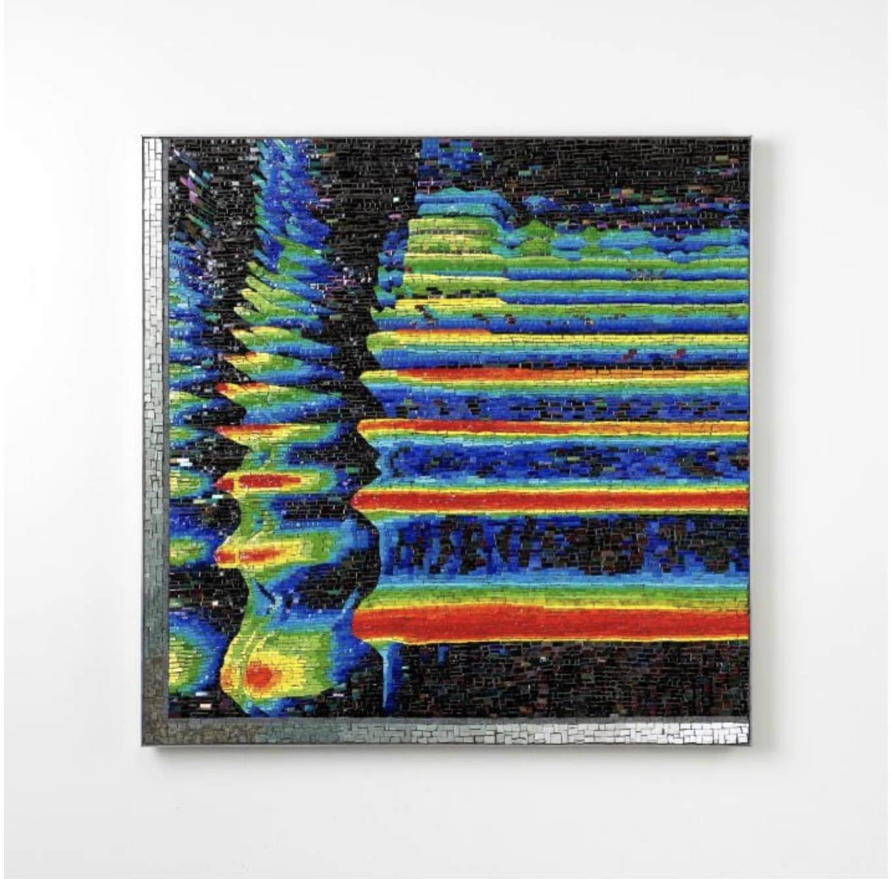

myor0395_9103_major_project_individual

# IDEA9103 Creative Coding Major Project - Individual Component

#### **Interacting with the Artwork**

To interact with the artwork, follow the following instructions:
1. Run 'index.html' with live server.
2. Music will play immediately.
3. Use the 'Play/Pause' button at the bottom of the screen in the centre to play or pause the music.
4. Move the cursor up and down to increase and decrease the volume of the music, respectively.
5. Move the cursor left and right to pan the sound between the left and right speakers, respectively.
6. Watch the artwork for the duration of the song to see the background change. 

#### **My Individual Approach to Animating the Group Code**

I chose to use audio to drive my individual code. 

**Animation in My Individual Artwork**

My artwork retains the background animation used in the group code. This animation involves pixelation of an image of fabric. The pixels are expanded into larger circular dots and move according to Perlin noise. However, in my individual work, the noise (offsets) of the pixels is amplified based on the average volume of the music (i.e., Perlin noise driven by audio).

To further animate the background and highlight the audio aspect of my work, I have included a dynamic spectrogram layered over the pixelated fabric image. To create this spectrogram, I ustilised the first 64 bins of a 128-bin FFT of the audio (Rage Against The Machine's 'Take The Power Back'). Moreover, the number of worm-like 'threads' in the artwork has been reduced to four, wiht each representing the frequency and amplitude of a unique subband of the audio. I decided to colour these 'threads' blue, red, white, and yellow/gold like the Filipino flag to acknowledge Pacita Abad's heritage.

The woven circles have also been reduced so there are only five and their aesthetics have been modified. Four of the woven circles expand based on the appropximate average amplitude of the bass and kickdrums in the audio. The centre weave expands based on the approximate average amplitude of the vocals and guitars. As such, the weaves appear to pulsate as the song plays.

My individual work is unique from that of other group members because it is driven by sound. It also has less emphasis on Pacita Abad's multimedia art style and focuses more on her life outside of her art such as her heritage and other passions. 

**Inspiration for my Individual Code**

For my interpretation of the group artwork, I was inspired by Pacita Abad's life outside of her artistic career. Pacita was born on 5 October 1946 in Basco, Batanes, a small group of islands in the Northern Philippines (Walker Art Center 2024). Pacita had a deep connection to her home and its culture throughout her life, stating in one interview when talking about her frequently travels, "I'd rather be known as a Filipino painter, wherever I am" (Metropolitan Museum of Manilla 2025). Pacita's love for The Philippines inspired me to include the colours of the Filipino flag in the 'worm-like' threads in my artwork as a subtle allusion to her heritage.

Prior to her introduction to the art world, Pacita studied Political Science and had plans to enter politics, following in her parents' footsteps (Metropolitan Museum of Manilla 2025). Despite her decision to pursue art instead of politics as a career, Pacita was heavily involved in her parents political campaigns and frequently fought for her beliefs (Walker Art Center 2024). In 1969, Pacita and her peers organised student demonstrations to protest the corruption in the re-election of Ferdinand Marcos as President of The Philippines, inspiring further protests elsewhere (Walker Art Center 2024). Pacita's outspokenness regarding her views led to a machine gun attack on her family home (Walker Art Center 2024). Pacita also had a passion for advocating for refugees and other minorities, with her visiting many refugee camps around the world throughout her life (Walker Art Center 2024). 

Pacita's enthusiasm for advocacy and challenging corruption inspired me to use the politically-charged song 'Take the Power Back' by Rage Against The Machine in my artwork. Although the song is written through an American lens, its message aligns with Pacita's fervor, defiantly denouncing government oppression and systemic issues affecting minorities, including "systemic racism, police brutality, media manipulation, cultural exploitation, and subjugation" (Walls 2022, p. 5).

In terms of aesthetics and techniques, I was inspired to feature a spectrogram in the work due to my background as a Speech Pathologist, where spectrograms are often used to examine clients' vocal quality and assess for voice disorders. I also drew inspiration from Jason Middlebrook's glass mosaic artwork entitled 'Sound Spectrogram' (2024) and its use of a rainbow spectrogram. The artwork inspired me to include an animated spectrogram across the background of my individual work. I also drew inspiration from the vibrant colours featured in Middlebrook's work. See the artwork below:

#### **Technical Explanation of My Individual Code**

There are three main elements to my individual artwork that will be discussed below:

1. Woven Circles
The circles identical to those that are featured in the group artwork, however they have been modified to have modifiable colours via the constructor. Furthermore, the weave 'update' function was changed so it now uses the amplitude to vary the size of the woven circle. Specifically, the amplitudes used depend on the average amplitude of specific bins within the FFT of the audio. The bins were carefully selected by analysing histograms of the music. I used the tutorial code to visualise and choose the bins based on amplitude. 

2. Background and Spectrogram
Similar to the woven circles, the background pixelated fabric image is mostly identical to that used within the group task, with several modifications to its parameters. For example, the number of circular 'pixels' on the image is defined by the size of an additional smaller FFT (128 bins) which was used to create a spectrogram. Furthermore, the noise is amplified by the average amplitude of the first 64 bins of the 128-bin FFT. The first 64 bins were selected as the top section of the FFT was largely 0 due to its representation of inaudible frequencies. To create the spectrogram effect, I utilised the same blur effect I used for the worm-like 'threads' in the group task to maintain the previous FFT outputs. The head of the spectrogram slides left to right across the screen, relative to the framerate. The colours were mapped using the HSV colour space to create a rainbow effect. Moreover, the dots at the spectrogram head vary in size based on their respective bin's amplitude. 

3. Worm-Like Threads
In the group task, the threads expreienced exponential decay. This is not the case in my individual work. In my artwork, the threads are used to represent both the flag of the Philippines and the average amplitudes of different FFT subbands. To implement this, I modified the worms to follow the spectrogram head at the same rate and removed the exponential term. THe sine wave frequencies are based on divisions of the framerate to avoid aliasing. 

#### **Reference List**

Metropolitan Museum of Manilla 2025, *PACITA ABAD: PHILIPPINE PAINTER*, viewed 16 November 2025, https://metmuseum.ph/pacitaabad#:~:text=This%20exhibition%20celebrates%20the%20late,art%2C%20becoming%20enamored%20of%20painting 

Middlebrook, J 2024, *Sound spectrogram*, University of Nabraska Omaha, viewed 11 November 2025, https://www.artworkarchive.com/profile/nebraskapublicart/artwork/sound-spectrogram-nebraska-1-for-public-art?collection=1-new-acquisitions-f614430d-e970-4010-911e-32525dd1aee3 

'Take the power back' 1991, on *Rage Against the Machine*, MP3, Epic Records, New York City. Written and performed by Rage Against the Machine.

Walker Art Center 2024, *Chronology of the life and Work of Pacita Abad*, viewed 15 November 2025, https://walkerart.org/magazine/chronology-of-the-life-of-pacita-abad/

Walls, T 2022, *Take the power back: How Rage Against The Machine's debut LP created rap-rock with a message*, viewed 16 November 2025, https://www.grammy.com/news/rage-against-the-machine-debut-album-30th-anniversary-creating-blueprint-for-rap-rock-with-a-message 